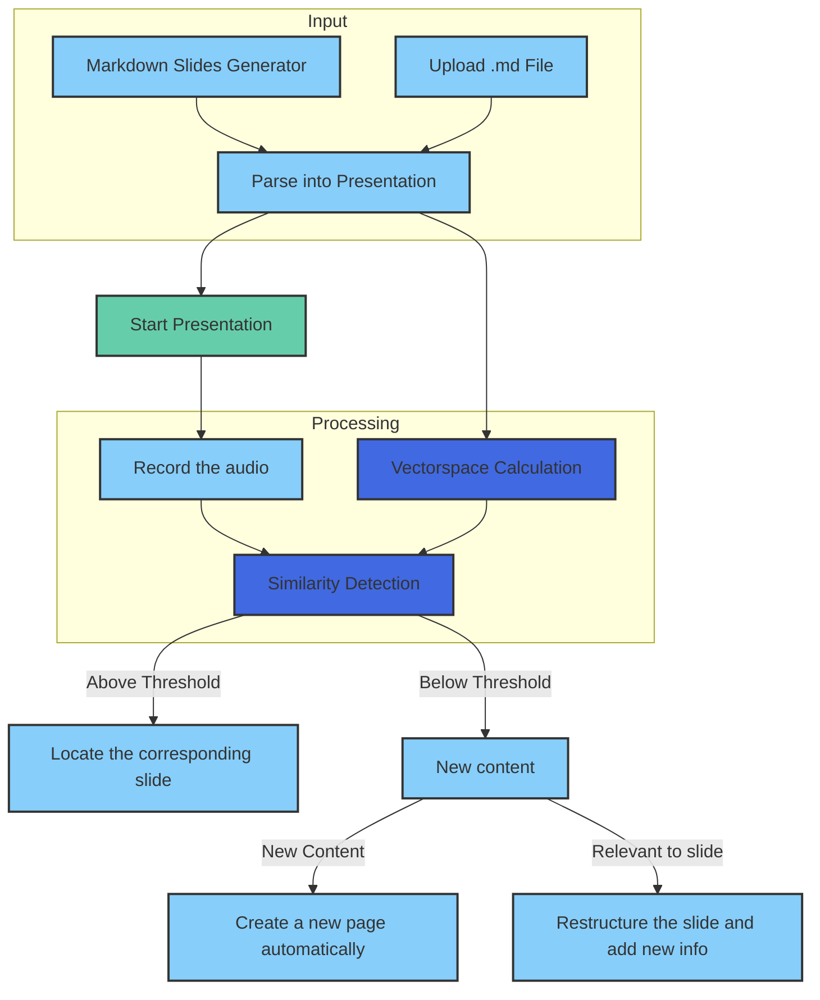

# 🎤 PitchPro AI – Revolutionizing Presentations 🚀

**PitchPro AI** is a powerful, AI-driven tool that turns static slides into interactive, real-time presentations. PitchPro listens, adapts, and guides your narrative, letting you focus on delivering an engaging message.

---

## 🌟 Key Features

- **🎯 Automatic Navigation**  
  PitchPro intelligently navigates your slides based on your speech, eliminating the need for manual control.

- **📈 Dynamic Content Expansion**  
  Adapts and expands content on-the-fly, so you can dive deeper or answer questions with ease.

- **🧠 Contextual Q&A Handling**  
  Respond to audience questions smoothly, as PitchPro ensures each response stays within context.

- **🎥 Smooth Speaker Flow**  
  Minimize manual transitions, maintain your natural rhythm, and let PitchPro handle the logistics.

---

## 🎬 Product Overview

1. **Upload Your Presentation**  
   Upload your markdown files and let PitchPro bring them to life.

2. **Real-Time Navigation**  
   PitchPro automatically navigates your slides as you present, freeing you to focus on the message.

3. **Dynamic Content Generation**  
   The AI actively listens and enriches your content in response to the conversation.

---

## 🏗️ Technical Architecture

PitchPro’s architecture combines voice analysis and AI-powered slide adaptation. Here’s an overview of the process:

---

## 🔍 Why PitchPro Stands Out

| Feature               | Traditional Tools  | PitchPro AI     |
|-----------------------|--------------------|------------------|
| Navigation            | Manual             | Automatic       |
| Content Adaptation    | Static             | Dynamic         |
| Speaker Focus         | Split              | Complete        |
| Q&A Handling          | Limited            | Seamless        |
| Setup Time            | Hours              | Minutes         |

---

## 📈 Market Opportunity

With **28 million presentations given daily** and a **$2 billion market** for presentation software, PitchPro AI is meeting the demand for intelligent, adaptive presentation tools that elevate audience engagement.

---

## 🤝 Contributing

We welcome contributions! Please refer to [CONTRIBUTING.md](CONTRIBUTING.md) for guidelines on how to get started.

## 📄 License

This project is licensed under the MIT License. See the [LICENSE](LICENSE) file for more details.

---

We're excited to have you join us in transforming presentations! 🎉
